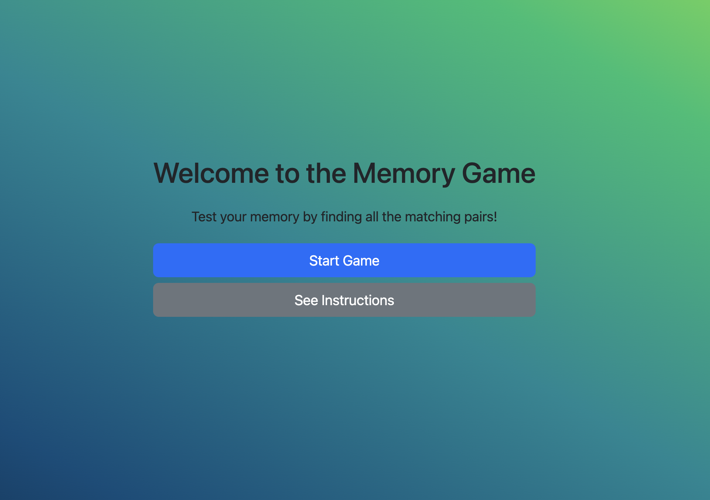
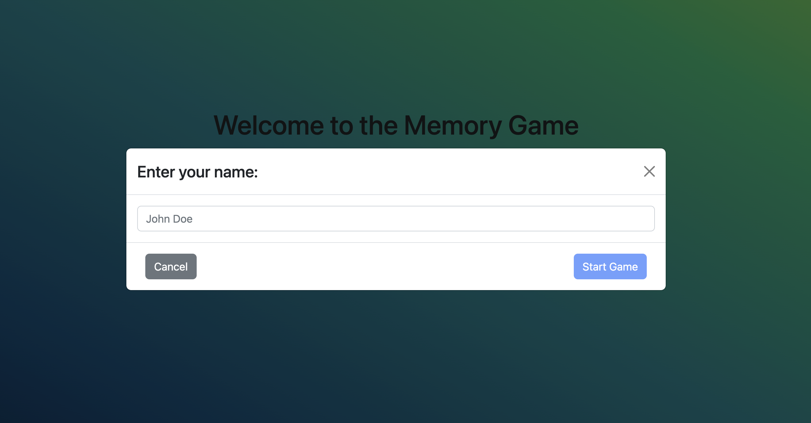
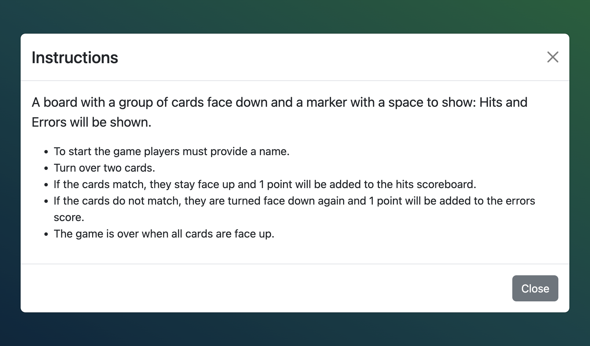
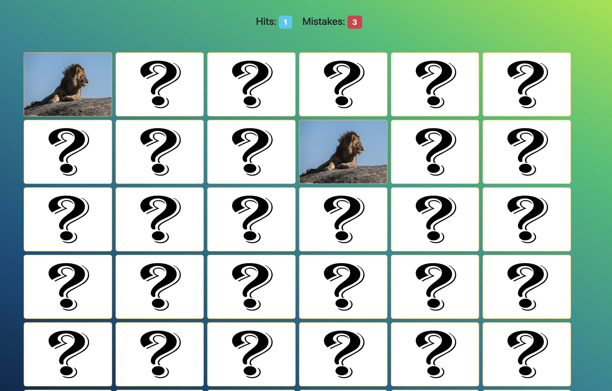
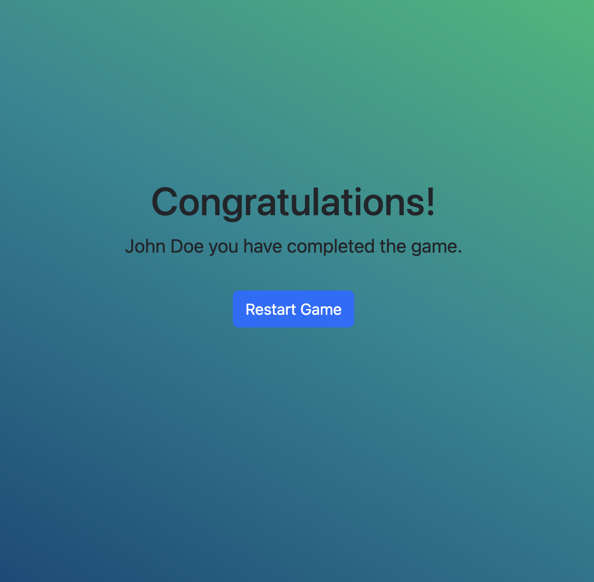

# Memory Game
Also known as Concentration Game

## Table of Content:

- [Memory Game](#memory-game)
  - [Table of Content:](#table-of-content)
  - [About The App](#about-the-app)
  - [Screenshots](#screenshots)
  - [Technologies](#technologies)
  - [Setup](#setup)
  - [Linting](#linting)
  - [Tests](#tests)
    - [Running all the tests](#running-all-the-tests)
    - [Running all the tests with a UI](#running-all-the-tests-with-a-ui)
    - [Running all the tests with Code Coverage](#running-all-the-tests-with-code-coverage)
  - [Running project locally](#running-project-locally)
  - [Building the project](#building-the-project)

## About The App
This application was built based on the following acceptances criteria:

- The first time a user enters the game they should be prompted for their name.

- Displays a board with a group of cards face down and a marker with a space to show: Mistakes and Hits.

- The player must flip over the cards trying to guess the cards that repeat.

- All cards are repeated 1 time on the board.

- For each turn the player must turn over 2 cards.

- If the cards do not match, add 1 point of error to the score.

- If the cards match, 1 hit point must be added to the scoreboard.

- The cards that the user guesses right should be turned face up while the error cards should be turned face down again.

- Once the user succeeds in guessing all the cards, a congratulatory message with the user's name should be displayed.

- In the congratulatory message screen users will be able to restart the game as well.

## Screenshots

- Welcome

- Player Input

- Instructions

- Game

- Congratulatory Message

## Technologies
I used `vite.js` which has support for React and TypeScript. The following were also implemented in this project:

- AirBnb Style Guide
- Conventional Commits
- Eslint
- Husky
- Prettier

## Setup
- Download or clone the repository
- Move to the project `cd memory-game`
- If you the `node version manager` installed in your computer you can run: `nvm use` to switch to the version I used to create the application.
  - If you don't have it installed you can refer to the `.nvmrc` file to see the mentioned version and update it on your local machine.
- Run `npm install`
- Run `npm run prepare`
- Rename the `env.example` file to `.env`. This file already has the required variables to run the application properly.

## Linting
To validate all your JavaScript code, run the linter: `npm run lint`

## Tests

### Running all the tests
Once you've followed the development instructions above, you can run the entire test suite locally:

`npm run test`

### Running all the tests with a UI
Powered by Vite, Vitest also has a dev server under the hood when running the tests. This allows Vitest to provide a beautiful UI to view and interact with our tests.

`npm run test:ui`

### Running all the tests with Code Coverage
This application also supports code coverage while running tests as follows:

`npm run test:coverage`

## Running project locally
You can run the following command:

`npm run dev`

The command above will start the server and will tell you the url and port so you can access to it.

## Building the project

You can run the following command to build the application:

`npm run build`
